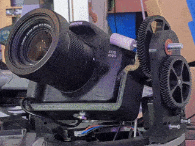
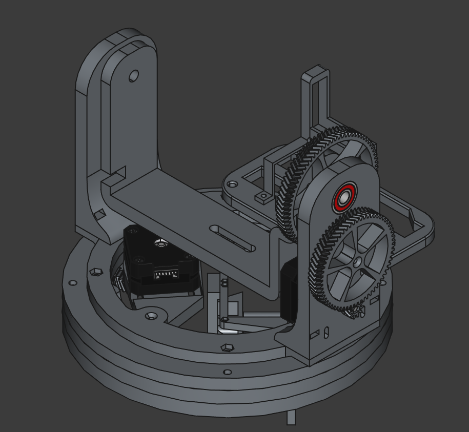
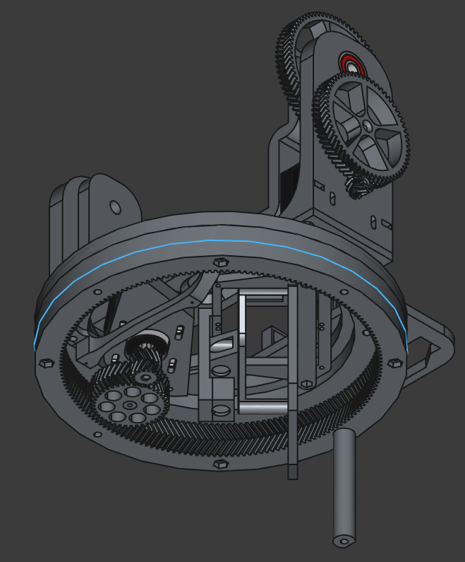
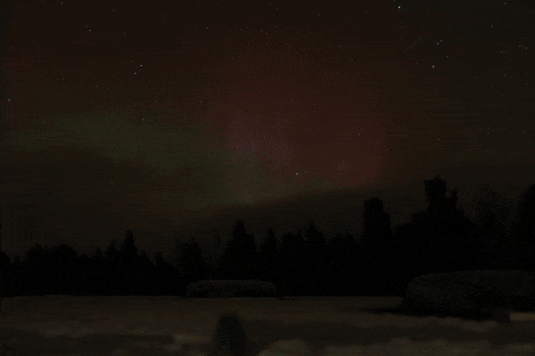

# pantiltlapse-rig

Two-axis motorized pan/tilt camera rig and automated timelapse controller for DSLRs.

A Python FastAPI backend controls the camera over `gphoto2` (USB PTP) and drives the stepper motors via serial ASCII commands to an ESP8266/ESP32 NodeMCU running `AccelStepper`. A zero-build HTML5/JS single-page web app provides live framing, 5x focus inspection, keyframe curve trajectory planning, and sequence execution.

---

### Hardware Prototype & CAD
| Prototype in Motion | Top View | Bottom View |
|:---:|:---:|:---:|
|  |  |  |

### Example Capture
> *Sub-zero night sky capture north of Kiruna, Sweden:*
> 

---

## Quick Start

### 1. Backend (Python 3.10+ with `uv`)
```bash
cd backend
uv sync
uv run python main.py
```
- **Web Studio UI**: `http://localhost:8000`
- **Camera & GPhoto2 Debug Workbench**: `http://localhost:8000/debug/camera`
- **Interactive REST API Docs**: `http://localhost:8000/docs`

> *Tip*: Set `FAKE_CAMERA=true` in `backend/.env` to run the full UI and trajectory simulation without a physical camera connected.

### 2. Firmware (NodeMCU v3 / ESP8266 / ESP32)
```bash
cd firmware
pio run
pio run --target upload
```

---

## Core Features & Workflow

1. **Setup & Live Framing** (`Step 1`):
   - Manual directional D-pad (0.5°, 1°, 5°, 15° steps), zero origin reference, motor driver enable/disable.
   - Live framing stream with night vision boost (CLAHE contrast equalization, gain & gamma multipliers) and real-time RGB histogram.
   - Enlarged theater viewport with HUD rig pose telemetry and **5x Focus Zoom Loupe** for fine manual focus adjustment.

2. **Key Poses & Trajectory Studio** (`Step 3`):
   - Independent **Pan** and **Tilt** keyframe tracks with draggable curve handles.
   - Progression time-slider mapping, real-time position visualizer, and dry-run rehearsal without shutter actuation.

3. **Acquisition & Test Shot Verification** (`Step 4`):
   - Camera parameter configuration (ISO, shutter speed, aperture, format) queried directly from the camera.
   - Interval timing verification ($t_{\text{shutter}} + t_{\text{settle}} < t_{\text{interval}}$).
   - High-resolution **Test Shot Verification Inspector** with smooth pan, 1:1 pixel sharpness inspection, and plan exposure adoption.

4. **Live Execution & Telemetry** (`Step 5`):
   - Automated sequence runner (Move → Settle → Shutter Trigger → Save Media).
   - Real-time progress percentage, ETA, latest frame review, pause/resume, and immediate emergency stop.

5. **Camera & GPhoto2 Debug Workbench** (`/debug/camera`):
   - Live stream monitor, raw widget tree scanner/setter, custom focus drive tester, and full-resolution shutter capture with persistent zoom & pan inspection across shots.
