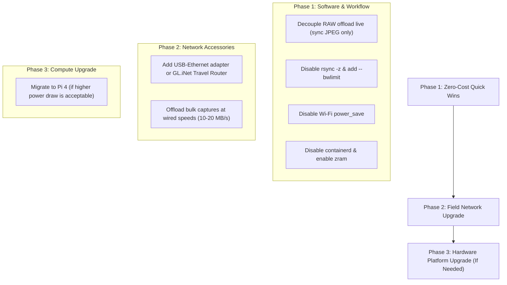

# Next-Generation Performance & Bandwidth Improvements

This document outlines the performance analysis, observed bottlenecks, and strategic options for improving network throughput, data offload speed, and Web GUI responsiveness on the Raspberry Pi Zero 2 W time-lapse rig.

---

## 1. Hardware Profile & Observed Rig Diagnostics

During live telemetry and inspection on the Raspberry Pi Zero 2 W:

| Metric / Component | Status / Observation | Impact on System |
|---|---|---|
| **Board & SoC** | Raspberry Pi Zero 2 W Rev 1.0 (quad-core ARM Cortex-A53) | Low power draw, but constrained memory and single USB 2.0 PHY. |
| **Wi-Fi Interface** | Integrated 2.4 GHz 802.11n AP (`camera_control`, ch 6, 20 MHz width) | Maximum real-world bandwidth is **2.5–4 MB/s** (~20–35 Mbit/s) under favorable signal conditions. |
| **Wi-Fi Power Save** | `Power save: on` | Induces latency spikes on small HTTP packets, making GUI controls feel sluggish. |
| **Memory & Swap** | 464 MB RAM total (~284 MB used, ~400 MB swap used on SD card) | Heavy disk I/O wait (`wa` ~17.5%) and `kswapd0` activity freeze Python event loop responsiveness. |
| **Background Processes** | `uvicorn` (~164 MB RSS), `containerd` (~12 MB RSS), `rsync` running live | Docker/containerd consumes valuable RAM on a 512 MB board. |
| **Per-Shot Payload** | Canon EOS 700D RAW (.CR2, ~24 MB) + JPEG (~5 MB) = **~29 MB / shot** | A 720-shot sequence produces **~21 GB**. At ~3 MB/s Wi-Fi throughput, live sync takes ~2 hours and saturates the link. |
| **Rsync Configuration** | Pulling with `-z` (compression enabled) | Compressing already-compressed JPEGs and raw sensor formats wastes Pi CPU cycles without bandwidth reduction. |
| **USB Bus Topology** | Single USB 2.0 root port hosting external Genesys Logic hub: Canon 700D + CH340 serial | USB 2.0 shared 480 Mbps bus bandwidth across camera transfers and serial motor control. |

---

## 2. Optimization Options

### Option A: Move Less Data Over Wi-Fi (Highest Impact, Zero Cost)
1. **Decouple RAW Offload from Active Live Shooting:**
   - Keep `.CR2` RAW files on the camera SD card (configured via gphoto2 capture target) or stage them locally on the Pi's storage.
   - Sync only preview JPEGs (~5 MB or less) during the shoot.
   - Offload the full RAW batch after the sequence finishes via wired connection or SD card reader.
   - *Impact:* Cuts live wireless data volume from ~29 MB/shot to ~5 MB/shot (an 83% reduction).
2. **Dedicated Low-Resolution GUI Previews:**
   - Serve a lightweight, pre-generated thumbnail or embedded JPEG preview for the Web GUI rather than full-resolution files.
3. **Optimize Browser Previews & Caching:**
   - Eliminate cache-busting timestamp queries (`?t=<timestamp>`) on unchanged preview assets to let the browser cache historical shots.

---

### Option B: Network & Sync Tuning (Zero Cost)
1. **Remove Compression (`-z`) from Rsync:**
   - `.CR2` and `.jpg` files are already compressed. Omitting `-z` saves Pi CPU time and eliminates decompression bottlenecks.
2. **Apply Bandwidth Limiting (`--bwlimit`):**
   - Cap rsync (e.g. `--bwlimit=1500` for 1.5 MB/s) so background file copying leaves headroom for Web GUI HTTP/SSE traffic.
3. **Use Lighter SSH Ciphers or Dedicated Rsync Daemon:**
   - The Pi Zero 2 W CPU lacks hardware AES acceleration.
   - Use ChaCha20-Poly1305: `-e "ssh -c chacha20-poly1305@openssh.com"`.
   - On an isolated ad-hoc Wi-Fi network, an unencrypted rsync daemon (`rsync://`) eliminates SSH crypto overhead entirely.

---

### Option C: System, Memory & CPU Optimization (Zero Cost)
1. **Disable Unused Container Services:**
   - Stop and disable Docker / `containerd` on the Pi (`sudo systemctl disable --now containerd docker`).
   - Frees ~15–25 MB of resident RAM and prevents background container daemon wakeups.
2. **Implement zram (Compressed RAM Swap):**
   - Replace swap on the micro-SD card with `zram-tools` (compressed RAM swap with `zstd` or `lz4`).
   - Prevents SD card thrashing and eliminates the ~17% I/O wait times stalling the FastAPI event loop.
3. **Profile Uvicorn Memory Footprint:**
   - Optimize image processing routines to avoid retaining multi-megabyte image buffers in memory.

---

### Option D: Wi-Fi Link Tuning (Zero Cost)
1. **Disable Wi-Fi Power Saving:**
   - Run `sudo iw dev wlan0 set power_save off` on boot (or via `/etc/network/interfaces` / NetworkManager).
   - Prevents the Wi-Fi chip from entering sleep states between frames, reducing HTTP request ping times.
2. **RF Channel Optimization:**
   - Scan local 2.4 GHz RF spectrum (`iwlist wlan0 scan`) and select an uncongested channel (1, 6, or 11).
3. **Physical Antenna Positioning:**
   - Maintain clear line of sight between the laptop and the Pi's PCB antenna.

---

### Option E: Inexpensive Hardware Upgrades (€15–60)

| Solution | Est. Speed | Practical Notes |
|---|---|---|
| **USB-to-Ethernet Adapter on Existing Hub** | ~8–11 MB/s (100 Mbps) / ~18–20 MB/s (Gigabit adapter on USB 2.0) | Plug-and-play into the existing USB hub. Connects directly to laptop via CAT6 cable. Shares USB bus with camera, but camera transfers only occur between motor moves. |
| **Pocket / Travel Router (e.g. GL.iNet Mango/Beryl)** | ~11 MB/s wired Pi link, fast 5 GHz Wi-Fi to laptop | Pi plugs into router via Ethernet; router broadcasts dual-band (2.4/5 GHz) Wi-Fi. Relieves the Pi from running hostapd/AP mode and provides superior range and signal in the field. |
| **USB 5 GHz Wi-Fi Dongle** | Variable (~10–15 MB/s) | Requires reliable Linux driver support for ARM64/ARMv7; adds USB bus overhead. |

*Note: USB OTG Gadget Ethernet mode directly from Pi to PC is not viable here because the Pi's only micro-USB data port is already acting as host to the USB hub, camera, and serial adapter.*

---

### Option F: Compute Board Replacement (€50–80)
- **Raspberry Pi 4 Model B (2 GB / 4 GB):**
  - Features dual-band 5 GHz Wi-Fi, native Gigabit Ethernet, USB 3.0 controller (separate PCIe bus from network), and 2–4 GB RAM.
  - Eliminates memory swapping, provides 30–80 MB/s transfer speeds over network, and handles concurrent live viewing effortlessly.
  - *Trade-off:* Higher power consumption (~3–5W vs ~1–1.5W for Zero 2 W), which impacts battery run time in portable rigs.

---

## 3. Recommended Roadmap

1. **Immediate Step (Software Tuning):**
   - Decouple live RAW syncing: keep RAW files on camera SD or Pi local storage; copy only JPEGs during execution.
   - Remove `-z` and set `--bwlimit=1500` in the external sync script.
   - Disable Wi-Fi power save and disable `containerd` to reclaim RAM and CPU cycles.
2. **Intermediate Step (~€20–40 Hardware):**
   - Add a USB Ethernet adapter to the hub or a GL.iNet travel router for field work to get fast 5 GHz wireless or direct cable connectivity.
3. **Long-Term Step:**
   - Only consider a Pi 4 upgrade if sequence capture frequencies or high-resolution live preview processing demands more CPU and RAM than the Zero 2 W can sustainably provide.
